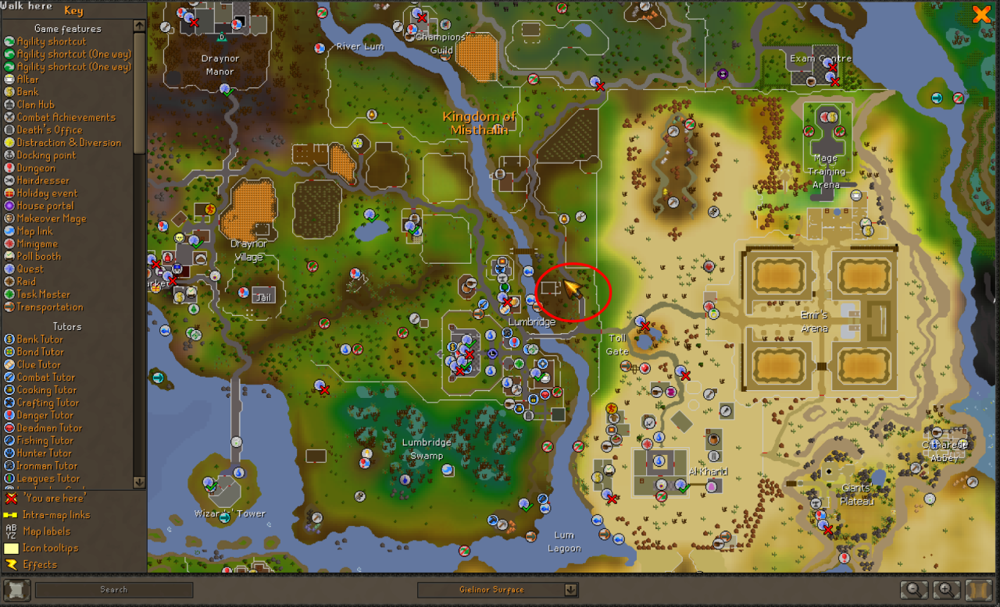

# Map Player Indicator

A RuneLite plugin that improves player orientation awareness by displaying a **directional indicator based on the player’s true facing direction**.

This plugin adds a **clear indicator to the world map** so you can instantly tell which direction your character is facing when viewing the World Map.

---

## Features

### 🧭 World Map Direction Indicator
Displays a **custom arrow on the world map** that:

- Points in the **exact direction your character is facing**
- Updates frequently while the player is moving

For people that are used to having this player arrow in other games, this adds an intuitive way to navigate RuneScape.

---

## ⚙️ Configuration

The plugin includes several configuration options:

| Setting | Description |
|-------|-------------|
| **World Map Indicator** | Enable or disable the animated world map arrow |
| **World Map Icon Size** | Adjust the size of the world map arrow |

---

## Why Use This Plugin?

The default RuneLite/OSRS UI shows your location, but it doesn't always make it obvious **which direction your character is facing**.

This plugin helps with:

- Navigating while using the **world map**
- Orienting yourself during **exploration**
- Quickly determining **movement direction**
- Improving **situational awareness**

---